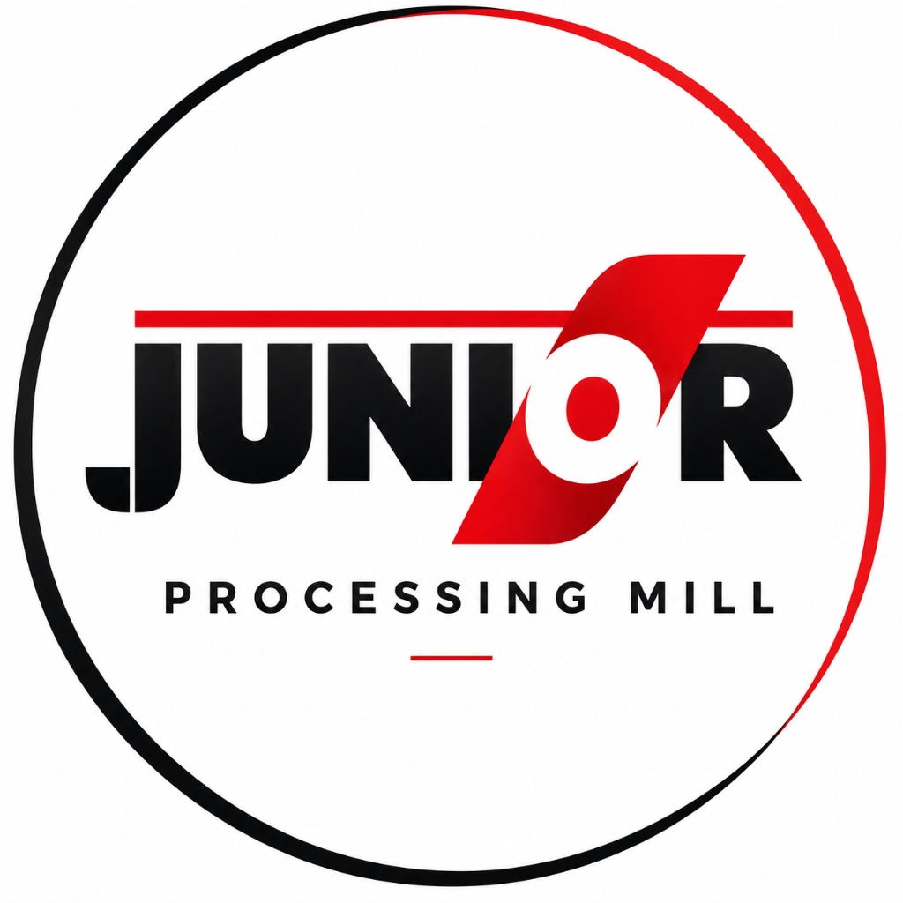

# DFR — Document / Bill Flow Register (Junior Processing Mill)

A modern, enterprise-grade Bill Flow Register & Executive Dashboard Web Application for **Junior Processing Mill (JPM)** tracking physical bill movement, custody handovers, dual ageing bands, and Tally/Payment completion pipelines.



---

## 🌟 Key Features

- **Custody & Physical Stage Tracking**: Track physical bills through `IAD → AO → Purchase → JMD → Accounts → Tally → Payment`.
- **Multi-Label System (`dfr.labels` & `dfr.bill_labels`)**: Full taxonomy management console (create, edit, delete multi-labels) and dynamic tagging.
- **Dual Ageing Calculations**:
  - **Overall Bill Ageing**: `effective_recd_date → current_date` (Age bands: `NORMAL` 0-2d, `A-3` 3-4d, `A-5` 5-9d, `A-10` ≥10d).
  - **Separate Tally Ageing**: `tally_posted_at → current_date` in the Payment Tracker pipeline.
- **Scheduled Near-Real-Time Synchronization**: 15-minute background sync simulation + on-demand **"Sync Now"** trigger.
- **Human Checkpoints & Audit History (`dfr.holder_history`)**: Mandatory explicit handover confirmations, Tally entry, Payment completion, and A-10 alert acknowledgments writing immutable history logs.
- **Active vs. Closed Bill Isolation**: Dashboard KPIs strictly exclude `PAID` / `CLOSED` bills while preserving audit history in full registers and CSV reports.
- **Interactive 3D Formatted Visuals**:
  - 3D Formatted Isometric Bar Charts (`BarChart3D.tsx`) for Holder and Owner workload distribution.
  - 3D Extruded Donut/Pie Chart (`PieChart3D.tsx`) for Ageing Band distribution.
  - Steady elevated card containers (`noTilt`) to ensure zero dashboard shaking during mouse movement.
- **Official JPM Branding**: Integrated Junior Processing Mill emblem logo across navigation headers and executive banners.
- **Clean Enterprise Light Theme**: Tailored HSL colors, crisp typography, and glassmorphism headers.

---

## 🚀 Tech Stack

- **Frontend**: React 18, TypeScript, Vite, Tailwind CSS, Lucide Icons, Canvas-Confetti
- **Charts**: Custom Isometric SVG 3D Renderers (`PieChart3D.tsx`, `BarChart3D.tsx`)
- **Backend & Database**: PostgreSQL DDL (`erp` & `dfr` schemas), Supabase Edge Functions / pg_cron ready
- **Architecture**: Strict No-n8n pipeline (all logic encapsulated inside app backend & database triggers)

---

## 📦 Installation & Local Setup

```bash
# Clone repository
git clone https://github.com/PRADEEP0502/DFR-JPM.git
cd DFR-JPM

# Install dependencies
npm install

# Start local development server
npm run dev
```

App will run on `http://localhost:5173`.

---

## 🗄️ Database Schema & Migration

The complete PostgreSQL migration DDL is located in [`supabase/schema.sql`](./supabase/schema.sql).

### Core Tables:
- `erp.bills`: Read-only Selsoft ERP mirror data
- `dfr.users`: Internal user personas (`VANITHA`, `KARUPPASAMY`, `SUGANYA`, `JANANI`, `JEYA SURIYA`, `HEMALATHA`, `ACCOUNTS`, `MANAGEMENT`)
- `dfr.bills`: Internal operational bill tracking (`gb_no`, `owner_id`, `current_holder_id`, `current_stage`, `dfr_status`)
- `dfr.holder_history`: Audit log of physical custody transfers
- `dfr.labels` & `dfr.bill_labels`: Multi-label tagging taxonomy
- `dfr.bill_register`: Calculated view deriving `age_days`, `age_band`, `tally_age_days`, and label arrays.

---

## 📜 License

Private project created for **Junior Processing Mill (JPM)**.
